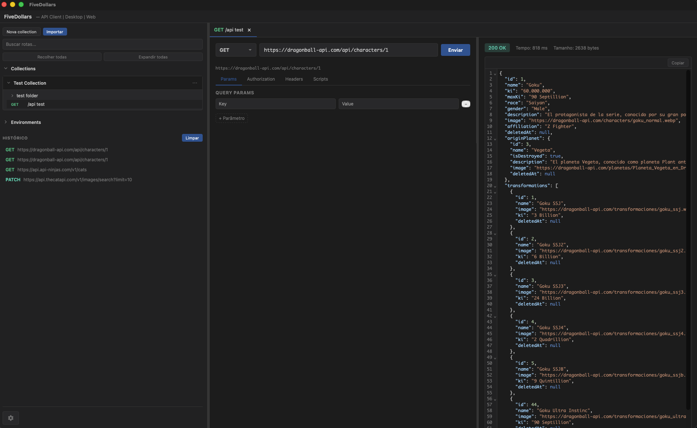
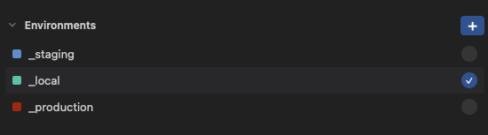
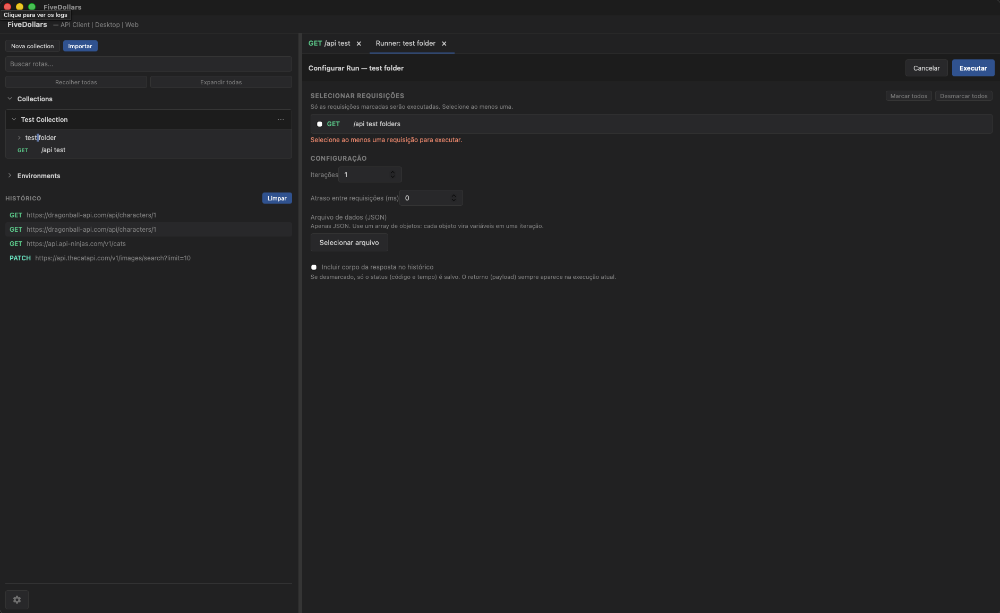
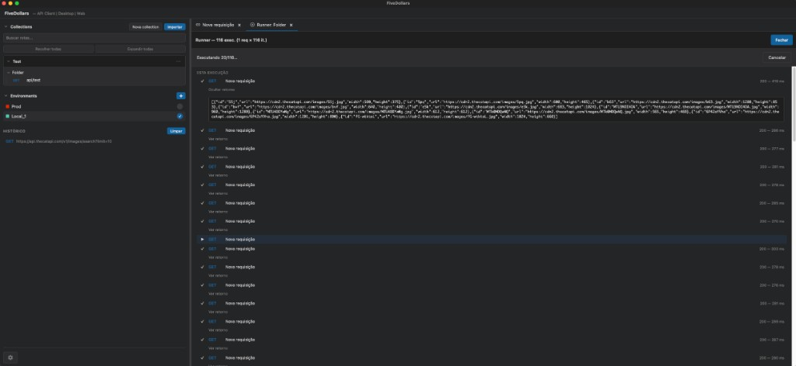

# FiveDollars API Client

**API Client** para Desktop e Web — alternativa ao Postman/Insomnia. Cliente de requisições HTTP com **React** e **Tauri** As requisições são enviadas pelo plugin HTTP do Tauri no processo nativo, evitando CORS do navegador.



---

## O que o app oferece

- **Collections** — organize requisições em pastas; importe collections **Postman v2.1** e **Insomnia** (JSON/YAML).
- **Environments** — ambientes com variáveis (`{{baseUrl}}`, `{{token}}`, etc.) e **cores para marcar importância ou tipo** (ex.: vermelho para Produção, verde para Local).
- **Runner** — execute várias requisições de uma pasta em sequência, com iterações, delay, arquivo de dados JSON e opção de salvar resposta no histórico.
- **Scripts** — Pre-request e Post-response por requisição (tokens dinâmicos, extrair dados da resposta, gravar em variáveis).
- **Requisições** — GET, POST, PUT, PATCH, DELETE; headers, query/path params, body (JSON, form, raw); auth Basic, Bearer, API Key.

---

## Environments (Ambientes) e cores

Crie ambientes na sidebar e defina variáveis (ex.: `baseUrl`, `token`). Use `{{nome}}` na URL, headers ou body; o ambiente ativo é aplicado antes do request.

Cada ambiente pode ter uma **cor** para você **tagar importância ou tipo** (produção, homologação, local, etc.) e identificar rapidamente na lista. Clique no ambiente para ativar; duplo clique para editar nome, variáveis e cor.



Exemplo: URL `{{baseUrl}}/api/users` com ambiente `{ "baseUrl": "https://api.exemplo.com" }` vira `https://api.exemplo.com/api/users`.

---

## Runner

Execute várias requisições de uma pasta em sequência:

- **Seleção** — escolha quais requisições rodar (marcar/desmarcar).
- **Iterações** — rode N vezes ou use um **arquivo de dados** (JSON com array de objetos); cada objeto vira um conjunto de variáveis por iteração.
- **Delay** — intervalo em ms entre requisições.
- **Corpo da resposta** — opção para incluir ou não o body nas entradas do histórico do run.

Abra o Runner pela pasta na sidebar (ex.: menu da pasta → "Run") e configure no painel antes de executar.

### Configurar execução (pasta)



### Runner em execução



---

## Importação de collections

- **Postman v2.1**: exporte a collection como JSON (Collection v2.1) e use **Importar** na sidebar.
- **Insomnia**: importe collections Insomnia (JSON ou YAML).

Após importar, pastas e requisições aparecem na sidebar; clique numa requisição para carregar e enviar.

---

## Scripts: Pre-request e Post-response

Por requisição (aba **Scripts** no painel da requisição):

- **Pre-request**: executado **antes** do envio.
  - API: `fv.environment.get(key)` / `fv.environment.set(key, value)`.
  - Se a requisição pertencer a uma collection: `fv.collectionVariables.get(key)` / `fv.collectionVariables.set(key, value)`.
  - Valores definidos com `set` são aplicados ao ambiente ativo (ou à collection) e usados na mesma requisição.
- **Post-response**: executado **depois** de receber a resposta.
  - API: `fv.response` (`.json()`, `.status`, `.statusText`, `.headers`, `.body`), `fv.environment.set(...)` e, se houver collection, `fv.collectionVariables.set(...)`.

Útil para tokens dinâmicos, timestamps, extrair dados da resposta e gravar em variáveis para as próximas requisições. Logs dos scripts aparecem na interface quando disponível.

---

## Requisições

Métodos: GET, POST, PUT, PATCH, DELETE. Suporte a headers, query params, path params e body (JSON, form, raw). Auth: Basic, Bearer, API Key (valores podem usar `{{var}}`).

---

# Para desenvolvedores

## Pré-requisitos

- **Node.js** 18+
- **Rust** (para o Tauri): [rustup.rs](https://rustup.rs)
- **npm** ou outro gerenciador de pacotes

### Linux (Ubuntu/Debian): dependências de sistema

Antes de `npm run tauri dev` ou `npm run tauri build`, instale as bibliotecas que o Tauri/WebKit usa:

```bash
sudo apt-get update
sudo apt-get install -y \
  libwebkit2gtk-4.1-dev \
  libglib2.0-dev \
  build-essential \
  curl \
  wget \
  file \
  libxdo-dev \
  libssl-dev \
  libayatana-appindicator3-dev \
  librsvg2-dev
```

---

## Como rodar o repositório

```bash
npm install
npm run tauri dev
```

O primeiro build do Rust pode demorar alguns minutos.

---

## Gerar executável (app instalável)

### 1. Ícone (opcional)

Use uma imagem **1024×1024 px** (PNG) e gere os ícones:

```bash
npm run tauri icon caminho/para/sua-imagem-1024.png
```

### 2. Build

```bash
npm install
npm run tauri build
```

### 3. Onde está o executável

| Plataforma | Pasta (em `src-tauri/`) | Arquivos |
|------------|-------------------------|----------|
| **Windows** | `target/release/bundle/msi/` e `target/release/bundle/nsis/` | `.msi`, `.exe` |
| **macOS**   | `target/release/bundle/dmg/` e `target/release/bundle/macos/` | `.dmg`, `.app` |
| **Linux**   | `target/release/bundle/deb/` ou `target/release/bundle/appimage/` | `.deb`, `.AppImage` |

---

## Release no GitHub (download: Mac, Windows, Linux)

O repositório tem um workflow que **gera o app para macOS, Windows e Linux** e **anexa ao Release** quando você publica um release.

### Versão (para quem for fazer release)

A versão precisa estar igual em `package.json` e `src-tauri/tauri.conf.json`. Use os scripts (qualquer dev pode usar):

| Comando | Efeito |
|--------|--------|
| `npm run patch` | Sobe o patch: `0.1.4` → `0.1.5` (atualiza os dois arquivos) |
| `npm run unpatch` | Desce o patch: `0.1.5` → `0.1.4` (útil para corrigir antes de publicar) |

Depois de rodar `npm run patch` (ou `unpatch`), faça commit das alterações antes de criar a tag.

### Passos do release

1. **Bump da versão**  
   `npm run patch` (ou edite manualmente os dois arquivos).

2. **Commit e push**  
   `git add package.json src-tauri/tauri.conf.json` → commit → push para o `main`.

3. **Publicar o release**  
   No GitHub: **Releases** → **Create a new release** → escolha ou crie uma tag (ex.: `v0.1.5`) → **Publish release**.  
   Ou use **Actions** → **Release** → **Run workflow** e informe a tag (ex.: `v0.1.5`).

4. **O que acontece**  
   O GitHub Actions roda o job **Release** em paralelo para **macOS**, **Linux** e **Windows**.  
   Ao terminar, o release da tag recebe os instaladores: **FiveDollars-macos.dmg**, **FiveDollars-windows.msi** (e/ou **.exe**), **FiveDollars-linux.AppImage** (e/ou **.deb**).

5. **Onde baixar**  
   No repositório: **Releases** → escolha a tag → baixe o arquivo do seu sistema.

- **macOS:** abra o `.dmg`, arraste o app para Aplicativos. Se aparecer *"FiveDollars is damaged"* (o app não é assinado com certificado Apple), use **botão direito no app** → **Abrir** → **Abrir** na confirmação. Alternativa no Terminal: `xattr -cr /Applications/FiveDollars.app`.
- **Windows:** execute o `.msi` ou o `.exe` do instalador.
- **Linux:** use o `.AppImage` (dar permissão de execução se precisar) ou instale o `.deb`.

---

## Estrutura do projeto

- **`src/`** – frontend React
  - **`components/`** – RequestPanel, ResponsePanel, Sidebar, CollectionTree, EnvironmentEditor, RunnerPanel, RunnerConfigPanel, RunnerContent, BodyEditor, etc.
  - **`store/`** – Zustand (estado global)
  - **`lib/`** – `http.ts` (fetch via Tauri), `resolveEnv.ts` (substituição de `{{var}}`), `importCollection.ts`, `runPostResponseScript.ts` (pre/post scripts), `urlUtils.ts`, parsers Postman/Insomnia
  - **`types/`** – tipos (collections, requests, environments)
- **`src-tauri/`** – backend Rust (Tauri 2 + plugin HTTP)
- **`App.css`** – tema dark (estilo VS Code), layout em colunas
