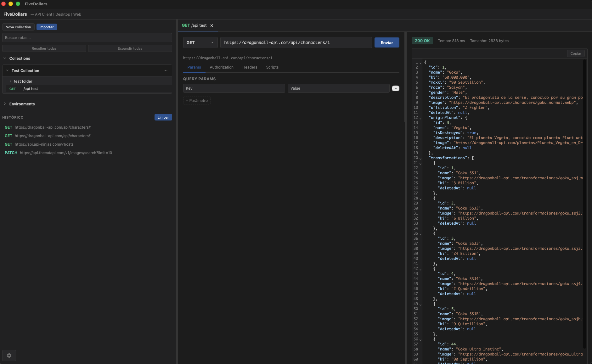
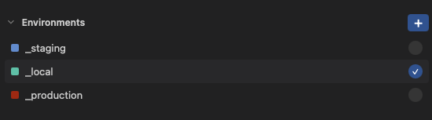
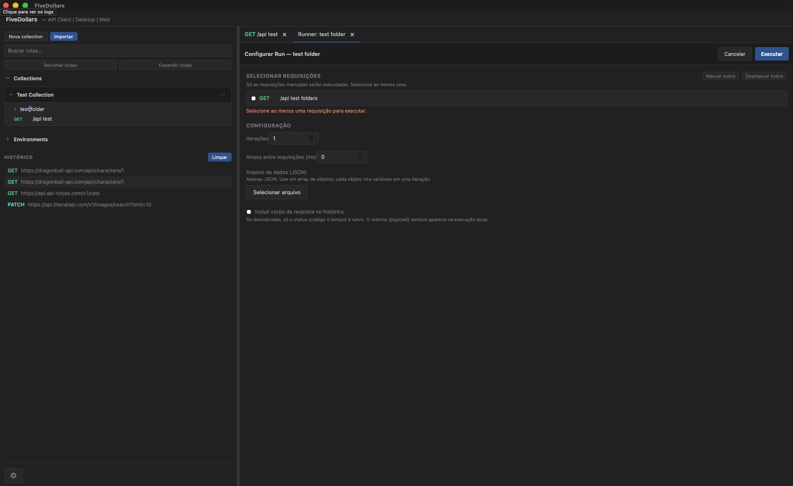
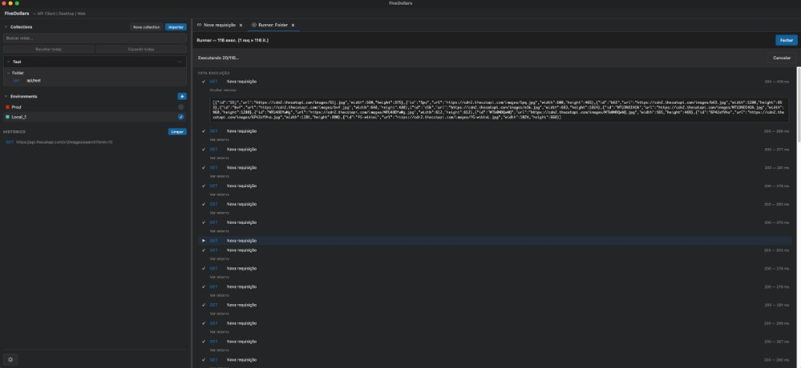

# FiveDollars API Client

**API Client** for Desktop and Web — an alternative to Postman/Insomnia. HTTP request client built with **React** and **Tauri**. Requests are sent via Tauri's HTTP plugin in the native process, avoiding browser CORS.

---

## What the app offers

- **Collections** — organize requests in folders; import **Postman v2.1** and **Insomnia** collections (JSON/YAML).
- **Environments** — environments with variables (`{{baseUrl}}`, `{{token}}`, etc.) and **colors to tag importance or type** (e.g. red for Production, green for Local).
- **Runner** — run multiple requests from a folder in sequence, with iterations, delay, JSON data file, and option to save response in history.
- **Scripts** — Pre-request and Post-response per request (dynamic tokens, extract data from response, write to variables).
- **Requests** — GET, POST, PUT, PATCH, DELETE; headers, query/path params, body (JSON, form, raw); Basic, Bearer, API Key auth.

---

## Environments and colors

Create environments in the sidebar and define variables (e.g. `baseUrl`, `token`). Use `{{name}}` in URL, headers or body; the active environment is applied before the request.

Each environment can have a **color** so you can **tag importance or type** (production, staging, local, etc.) and spot it quickly in the list. Click an environment to activate; double-click to edit name, variables and color.

Example: URL `{{baseUrl}}/api/users` with environment `{ "baseUrl": "https://api.example.com" }` becomes `https://api.example.com/api/users`.

---

## Runner

Run multiple requests from a folder in sequence:

- **Selection** — choose which requests to run (check/uncheck).
- **Iterations** — run N times or use a **data file** (JSON array of objects); each object becomes a set of variables per iteration.
- **Delay** — interval in ms between requests.
- **Response body** — option to include or exclude the body in run history entries.

Open the Runner from a folder in the sidebar (e.g. folder menu → "Run") and configure in the panel before executing.

### Configure run (folder)

### Runner in progress

---

## Importing collections

- **Postman v2.1**: export the collection as JSON (Collection v2.1) and use **Import** in the sidebar.
- **Insomnia**: import Insomnia collections (JSON or YAML).

After importing, folders and requests appear in the sidebar; click a request to load and send it.

---

## Scripts: Pre-request and Post-response

Per request (**Scripts** tab in the request panel):

- **Pre-request**: runs **before** sending.
  - API: `fv.environment.get(key)` / `fv.environment.set(key, value)`.
  - If the request belongs to a collection: `fv.collectionVariables.get(key)` / `fv.collectionVariables.set(key, value)`.
  - Values set with `set` are applied to the active environment (or the collection) and used in the same request.
- **Post-response**: runs **after** receiving the response.
  - API: `fv.response` (`.json()`, `.status`, `.statusText`, `.headers`, `.body`), `fv.environment.set(...)` and, if there is a collection, `fv.collectionVariables.set(...)`.

Useful for dynamic tokens, timestamps, extracting data from the response and writing to variables for the next requests. Script logs appear in the UI when available.

---

## Requests

Methods: GET, POST, PUT, PATCH, DELETE. Support for headers, query params, path params and body (JSON, form, raw). Auth: Basic, Bearer, API Key (values can use `{{var}}`).

---

### Common errors

- *"FiveDollars is damaged"*  
  Run in Terminal: `xattr -cr /Applications/FiveDollars.app`

---