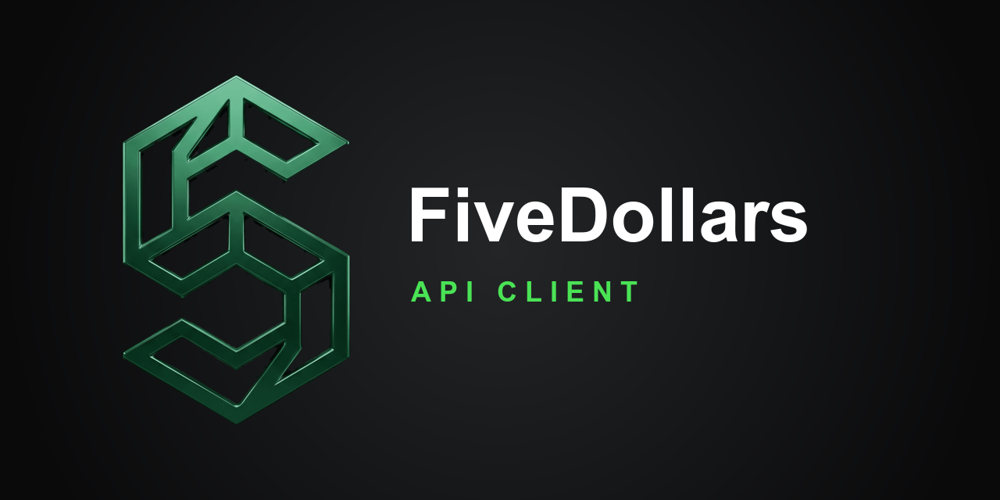
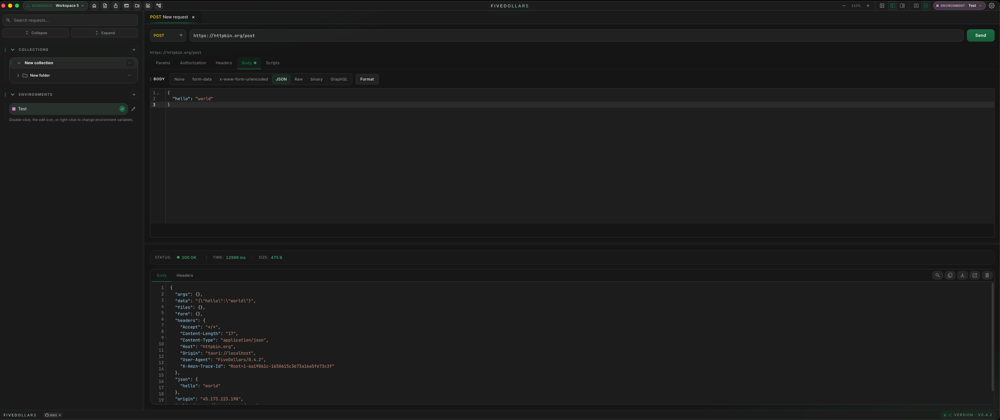

<div align="center">



**O cliente HTTP do seu dia a dia, 100% local. E agora, SQL junto.**

Uma alternativa focada em privacidade ao Postman e ao Insomnia — e a um cliente
SQL pesado. Crie, organize e automatize requisições HTTP com ambientes, scripts,
um executor em lote, um canvas de requisições executável e sincronização via Git.
Depois consulte seu banco no mesmo app e rode um cockpit de agentes de IA do
lado — no macOS, Windows e Linux.

[](https://marketplace.visualstudio.com/items?itemName=LeandroDettmer.fivedollars)
[](https://open-vsx.org/extension/LeandroDettmer/fivedollars)
[](https://www.npmjs.com/package/fivedollars-mcp)
[](https://fivedollars.dev)
[](https://github.com/LeandroDettmer/FiveDollars)

[**Aplicativo web**](https://app.fivedollars.dev) · [**Baixar desktop**](https://fivedollars.dev/install) · [**Extensão VSCode**](https://marketplace.visualstudio.com/items?itemName=LeandroDettmer.fivedollars) · [**Documentação**](https://fivedollars.dev/docs) · [**Site**](https://fivedollars.dev)

[English](README.md) · **Português (Brasil)**

</div>

<br />

<!-- A captura principal fica em screenshots/app.png. Troque por um print da UI
     atual (de preferência com a aba SQL ou o grid do FiveCoding à vista) sempre
     que a interface mudar. -->
<div align="center">
  
</div>

<br />

---

## Visão geral

O FiveDollars é um cliente de API local-first que roda nativamente no desktop, no
navegador e dentro do seu editor — todos compartilhando o mesmo formato de
workspace. Sem conta, sem proxy, sem assinatura. No desktop ele vai além: um
cliente SQL embutido, um cockpit de terminais reais rodando seus agentes de
código com IA, e recursos de IA que usam o CLI que você já tem instalado.

- **Gratuito.** O cliente principal é gratuito no desktop e na web. Não é
  necessário criar conta para começar.
- **Local-first.** Coleções, ambientes e tokens permanecem na sua máquina, e o app
  funciona offline.
- **Multiplataforma.** Desktop nativo para macOS, Windows e Linux (Tauri),
  aplicativo web no navegador e uma extensão para VSCode / Cursor compartilham o
  mesmo formato de workspace.
- **HTTP + SQL + agentes de IA.** Uma janela só para a requisição que você está
  depurando, a query por trás dela e os agentes escrevendo a correção.
- **Automatizável.** Requisições com scripts, executor em lote, canvas executável
  e um servidor MCP que permite a assistentes de IA operar suas requisições
  salvas.
- **Migre em minutos.** Importe coleções existentes do Postman, Insomnia, OpenAPI,
  HAR, cURL e Hoppscotch e continue trabalhando.

Feito com React, TypeScript, Tauri 2 e Rust. O HTTP passa pela camada nativa,
então não há proxy no meio nem contornos de CORS.

---

## Onde usar

| Plataforma | Link |
|---|---|
| Aplicativo web | https://app.fivedollars.dev |
| Aplicativo desktop | https://fivedollars.dev/install |
| Extensão VSCode | https://marketplace.visualstudio.com/items?itemName=LeandroDettmer.fivedollars |
| Extensão Open VSX | https://open-vsx.org/extension/LeandroDettmer/fivedollars |
| Servidor MCP | https://www.npmjs.com/package/fivedollars-mcp |

> O cliente SQL, o FiveCoding, a IA no app e a captura de login são **beta e só no
> app desktop**. Ficam escondidos no aplicativo web e na extensão VSCode.

---

## Funcionalidades

### Cliente HTTP

**Métodos:** GET, POST, PUT, PATCH, DELETE, HEAD, OPTIONS, CONNECT, TRACE — mais
**WebSocket, SSE e MQTT** como tipos de requisição de primeira classe, não
plugins.

**Corpo e parâmetros:** cabeçalhos, query params, path params, JSON, form data,
URL-encoded, raw, binário, GraphQL. Anexe um arquivo direto de um corpo JSON
digitando `{chave}` — o payload Base64 é substituído somente no momento do envio.

**Autenticação:** 12 esquemas — Basic, Bearer, API key, JWT, Digest, OAuth 1.0,
OAuth 2.0, Hawk, AWS SigV4, NTLM, Akamai EdgeGrid e ASAP — mais `inherit`, então
uma pasta ou coleção define a auth uma vez e toda requisição abaixo dela herda.
O OAuth 2.0 recebe um token que você cola; ainda não há grant flow embutido.

**Área de trabalho:** arraste uma aba para a direita do painel principal e tenha
split view no estilo VS Code, abra múltiplas janelas no mesmo workspace e chegue
em tudo pela paleta de comandos.

### Cliente SQL · beta, só no desktop

<!-- Descomente quando screenshots/sql.png existir:
<div align="center">
  
</div>
-->

Um cliente de banco estilo TablePlus dentro do app: conecte em **PostgreSQL,
MySQL, SQLite ou SQL Server**, navegue por tabelas, views e índices, e escreva SQL
com autocomplete ciente do dialeto.

- **Rode e leia.** Resultados em grid, `EXPLAIN` renderizado como grafo e um
  histórico de queries que guarda os resultados em cache.
- **Edite como planilha.** Altere células no grid de resultado; as edições ficam
  em staging e só são aplicadas quando você confirma.
- **Trilhos de segurança.** Confirmação para statements perigosos — `DELETE` ou
  `UPDATE` sem `WHERE`, `DROP` e companhia.
- **Process list.** Inspecione as queries em execução e mate a que está segurando
  o lock.
- **Salvo como um nó.** A aba inteira — conexão mais todas as sub abas de query —
  é salva como um único nó na coleção e reabre exatamente como você deixou. Senhas
  nunca vão para o `data.json`.

### FiveCoding · beta, só no desktop

<!-- Descomente quando screenshots/fivecoding.png existir:
<div align="center">
  
</div>
-->

**Um cockpit pros seus agentes de código. Até 9 terminais reais, lado a lado.**

FiveCoding roda Claude Code, Codex, Gemini CLI ou qualquer comando em terminais de
verdade dentro do FiveDollars. Cada um na sua pasta, opcionalmente num worktree
git isolado — e um Claude "maestro" pode abrir os outros, despachar tarefas e
coletar os reports via MCP.

- **Terminais de verdade.** PTY real com a TUI original do agente: atalhos,
  `/comandos` e cores funcionam como no seu terminal.
- **Worktrees isolados.** Vários agentes no mesmo repo, cada um na sua branch —
  ninguém pisa no trabalho de ninguém.
- **Maestro & scouts.** Um Claude pilota o cockpit: abre terminais, manda
  instruções e coleta os resultados, tudo via MCP local.
- **Sessões que voltam.** Fechou o app? Ao reabrir, cada terminal retoma a
  conversa exatamente de onde parou, com scrollback.
- **Cockpit na collection.** Salve o grid inteiro como um nó da collection e
  reabra o mesmo setup com um clique — a conversa nunca vai junto.
- **Tokens ao vivo.** Medidor na toolbar somando os tokens da aba em tempo real
  enquanto os agentes trabalham.
- **Painel de changes.** O `git diff` de cada pane, do lado do terminal que o
  produziu.

Abra pelo menu "+" do header do app.

### IA no app · beta, só no desktop

O FiveDollars usa o CLI de IA que você já tem — `claude`, `codex` ou `gemini`.
**Sem API key, sem conta FiveDollars e nada passando pelos nossos servidores:** o
app chama o binário da sua máquina.

Ele gera testes para uma resposta, monta uma requisição a partir de uma descrição
em linguagem natural, escreve SQL (com seu schema e índices como contexto, mais um
aviso quando a query parece cara), e rascunha fluxos de diagrama. Todo resultado
aparece primeiro como preview — o app nunca aplica uma mudança sozinho.

### Coleções & importação

Organize requisições em pastas e coleções, arraste para reordenar ou mover entre
coleções, aninhe pastas e execute uma pasta inteira de uma vez.

Importações: **Postman Collection v2.1**, **Insomnia** (JSON e YAML),
**OpenAPI / Swagger**, **HAR**, **cURL** e **Hoppscotch**. Exporta de volta para
Postman v2.1 e gera documentação em Markdown a partir de uma coleção.

### Ambientes

Defina variáveis uma vez e reutilize em qualquer lugar:

```txt
{{baseUrl}}
{{token}}
```

Utilizáveis em URLs, cabeçalhos, query params, corpos e campos de autenticação.
Cada ambiente carrega uma cor para que local, staging e produção fiquem
visualmente distintos. Helpers de mock data têm autocomplete enquanto você digita,
e variáveis privadas por coleção mantêm segredos fora do workspace compartilhado.

### Runner

Execute uma pasta de requisições:

- sequencialmente ou em paralelo
- com atrasos entre chamadas
- em múltiplas iterações
- **alimentado por um arquivo JSON**, uma execução por linha, com retry apenas das
  linhas que falharam

As execuções continuam em background enquanto você troca de workspace.

### Scripts & testes

Execute JavaScript em sandbox antes ou depois de uma requisição para renovar
tokens, armazenar variáveis, interpretar respostas ou encadear chamadas.

```js
const { token } = fv.response.json();
fv.environment.set("token", token);
```

As APIs disponíveis incluem `fv.environment`, `fv.collectionVariables` e
`fv.response.json()`.

Prefere sem código? Os **testes codeless** montam asserções a partir de um campo,
um operador e um valor esperado. O **contract drift** avisa quando uma resposta
deixa de bater com o formato que a requisição costumava devolver.

### Canvas de diagrama

Monte um fluxo visualmente e execute. Cinco tipos de nó:

| Nó | O que faz |
|---|---|
| Request | Roda uma requisição HTTP; a resposta alimenta o próximo nó |
| SQL | Roda uma query em uma conexão salva |
| Data list | Itera uma lista com for-each |
| Login capture | Abre um browser embutido, você faz login, o token é extraído |
| Agent | Despacha um agente do FiveCoding e espera o report |

Extraia variáveis das respostas com caminhos usando wildcards, ramifique com
if/else e mantenha notas inline documentando o fluxo — tudo salvo dentro da
própria coleção.

> Os nós de agente rodam **sequencialmente**: dois nós de agente desenhados em
> paralelo ainda executam um depois do outro.

### Schedules

Agende uma requisição ou uma sequência inteira do Runner em horário fixo ou por
intervalo — "a cada 30 minutos", "às 09:00". Os schedules rodam **enquanto o app
está aberto**; não há daemon e nada roda na nossa nuvem.

### Git & sincronização

- **Git sync.** Sincronize um workspace com seu próprio repositório no GitHub,
  armazenado em `.fivedollars/workspace.json`. Faça pull, commit e troca de
  branch, e os pull requests passam a ser o canal de revisão das mudanças nas
  coleções.
- **Sync criptografado via API do GitHub.** Criptografia ponta a ponta
  (Argon2id → AES-256-GCM) e funciona sem git instalado — inclusive pelo Safari no
  celular.
- **Pair Device.** Leve um workspace para outro dispositivo lendo um QR code. A
  chave viaja no fragmento da URL, então nunca chega ao GitHub.

---

## Extensão VSCode

Uma extensão opcional para VSCode, Cursor, VSCodium e outros editores compatíveis
com Open VSX. Mesma UI do app desktop, embutida no seu editor, com o HTTP passando
pelo extension host — sem CORS, sem cabeçalhos removidos.

```bash
# VS Marketplace
code --install-extension LeandroDettmer.fivedollars

# Open VSX (Cursor / VSCodium)
cursor --install-extension LeandroDettmer.fivedollars
codium --install-extension LeandroDettmer.fivedollars
```

Ou instale manualmente a partir de um arquivo `.vsix`. Depois, abra a paleta de
comandos e execute:

```txt
FiveDollars: Open
```

---

## Servidor MCP

O `fivedollars-mcp` permite que assistentes de IA como Claude e Cursor leiam e
executem suas requisições e coleções salvas — 19 tools no total. Adicione-o à sua
configuração MCP:

```json
{
  "mcpServers": {
    "fivedollars": {
      "command": "npx",
      "args": ["-y", "fivedollars-mcp"]
    }
  }
}
```

Depois é só pedir coisas como:

- "Liste minhas coleções"
- "Envie a requisição get-user usando staging"
- "Importe essa spec OpenAPI numa coleção" — o `import_from_spec` também aceita
  coleções do Postman e cURL puro
- "Escaneie as rotas desse repo e crie as requisições" — o `import_from_source`
  lê handlers de Express, Fastify, NestJS e FastAPI
- "Abra três agentes e despache essa tarefa" — cinco tools do cockpit pilotam o
  FiveCoding

Tudo que um assistente cria cai numa **inbox MCP** para você revisar antes de
tocar no seu workspace. Tudo roda localmente sobre o seu workspace FiveDollars
existente.

---

## Privacidade

- Coleções e ambientes permanecem na sua máquina.
- As requisições vão diretamente para a URL de destino, sem proxy no meio.
- **A IA roda pelo seu CLI local.** Sem API key, e nenhum prompt ou resposta é
  enviado para um servidor do FiveDollars.
- Tokens do GitHub ficam no keychain do sistema operacional; senhas de banco vão
  para o storage de segredos do app, nunca para o arquivo de workspace.
- O MCP lê apenas dados locais do workspace.
- O dashboard de uso é agregado no próprio dispositivo.
- A telemetria opcional pode ser desativada nas configurações.

Consulte [SECURITY.md](SECURITY.md) para a política de segurança e como relatar
uma vulnerabilidade.

---

## Personalização

- Vários temas, claros e escuros.
- Atalhos de teclado remapeáveis para as ações que você mais usa.
- Escolha sua própria fonte monoespaçada para editores e terminais.
- Dashboards de uso e de storage, calculados localmente.

---

## Solução de problemas

| Problema | Solução |
|---|---|
| macOS informa que o app está corrompido | Execute `xattr -cr /Applications/FiveDollars.app` |
| Instalador errado baixado | Baixe diretamente pelo GitHub Releases |
| MCP não encontra o workspace | Abra o app ao menos uma vez para criar os dados do workspace |
| Ferramentas MCP não aparecem | Reinicie o Claude / Cursor após editar a configuração MCP |
| A aba SQL ou FiveCoding não aparece | As duas são só no desktop — ficam escondidas no app web e na extensão VSCode |
| FiveCoding não consegue iniciar um agente | Verifique se o CLI (`claude`, `codex`, `gemini`) está no seu `PATH` |

---

## Download

- Site — https://fivedollars.dev
- Aplicativo desktop — https://fivedollars.dev/install
- Releases — https://github.com/LeandroDettmer/FiveDollars/releases

---

## Links

- Documentação — https://fivedollars.dev/docs
- GitHub — https://github.com/LeandroDettmer/FiveDollars
- Issues — https://github.com/LeandroDettmer/FiveDollars/issues
- VS Marketplace — https://marketplace.visualstudio.com/items?itemName=LeandroDettmer.fivedollars
- Open VSX — https://open-vsx.org/extension/LeandroDettmer/fivedollars
- Pacote MCP — https://www.npmjs.com/package/fivedollars-mcp

---

<div align="center">
<sub>Feito com React, Tauri e Rust · Local-first · Gratuito</sub>
</div>
