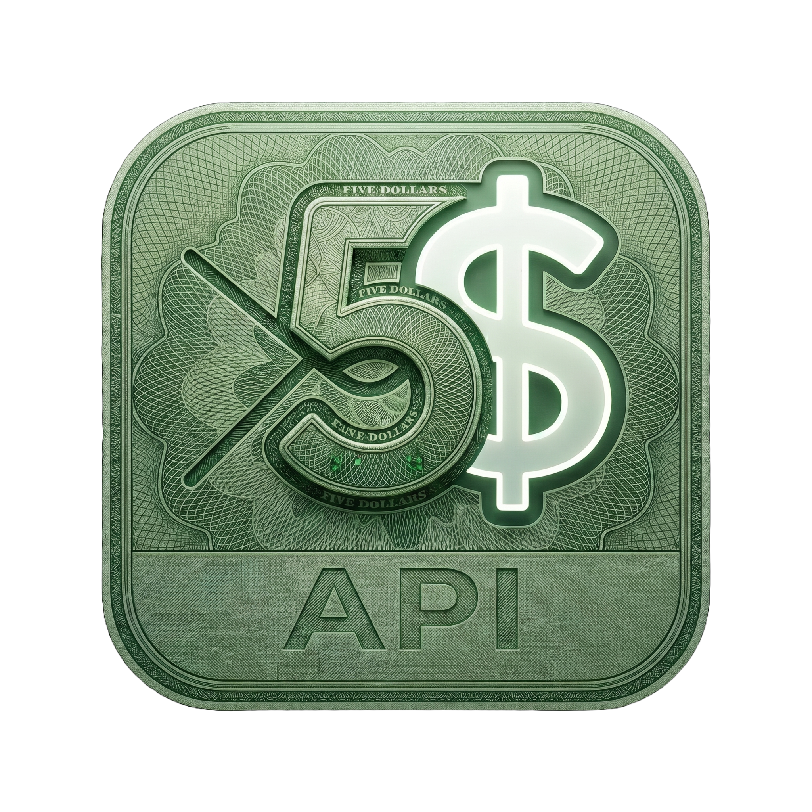

<div align="center">



# FiveDollars API Client

**Um cliente de API rápido e gratuito para desktop, web e seu editor.**

Uma alternativa local e focada em privacidade ao Postman e ao Insomnia. Crie,
organize e automatize requisições HTTP com ambientes, scripts, um executor em
lote, um canvas visual de requisições, sincronização via Git e um servidor MCP
para assistentes de IA — no macOS, Windows e Linux.

[](https://marketplace.visualstudio.com/items?itemName=LeandroDettmer.fivedollars)
[](https://open-vsx.org/extension/LeandroDettmer/fivedollars)
[](https://www.npmjs.com/package/fivedollars-mcp)
[](https://fivedollars.dev)
[](https://github.com/LeandroDettmer/FiveDollars)

[**Aplicativo web**](https://app.fivedollars.dev) · [**Baixar desktop**](https://fivedollars.dev/install) · [**Extensão VSCode**](https://marketplace.visualstudio.com/items?itemName=LeandroDettmer.fivedollars) · [**Site**](https://fivedollars.dev)

[English](README.md) · **Português (Brasil)**

</div>

<br />

<!-- Coloque a captura de tela em screenshots/app.png para exibi-la aqui -->
<div align="center">
  
</div>

<br />

---

## Visão geral

O FiveDollars é um cliente de API local-first que roda nativamente no desktop, no
navegador e dentro do seu editor — todos compartilhando o mesmo formato de
workspace. É uma alternativa ao Postman e ao Insomnia focada em privacidade, feita
para quem quer testar e automatizar requisições HTTP sem conta, sem proxy e sem
assinatura.

- **Gratuito.** O cliente principal é gratuito no desktop e na web. Não é
  necessário criar conta para começar.
- **Local-first.** Coleções, ambientes e tokens permanecem na sua máquina, e o app
  funciona offline.
- **Multiplataforma.** Desktop nativo para macOS, Windows e Linux (Tauri),
  aplicativo web no navegador e uma extensão para VSCode / Cursor compartilham o
  mesmo formato de workspace.
- **Automatizável.** Requisições com scripts, executor em lote, canvas visual e um
  servidor MCP que permite a assistentes de IA operar suas requisições salvas.
- **Migre em minutos.** Importe suas coleções existentes do Postman e do Insomnia
  e continue trabalhando.

Feito com React, TypeScript e Tauri 2. O HTTP passa pela camada nativa, então não
há proxy no meio nem contornos de CORS.

---

## Onde usar

| Plataforma | Link |
|---|---|
| Aplicativo web | https://app.fivedollars.dev |
| Aplicativo desktop | https://fivedollars.dev/install |
| Extensão VSCode | https://marketplace.visualstudio.com/items?itemName=LeandroDettmer.fivedollars |
| Extensão Open VSX | https://open-vsx.org/extension/LeandroDettmer/fivedollars |
| Servidor MCP | https://www.npmjs.com/package/fivedollars-mcp |

---

## Funcionalidades

### Coleções

Organize requisições em pastas e coleções. Arraste para reordenar, aninhe pastas
e execute uma pasta inteira de uma vez.

Importa de outras ferramentas:

- Postman Collection v2.1
- Insomnia JSON
- Insomnia YAML

### Ambientes

Defina variáveis uma vez e reutilize em qualquer lugar:

```txt
{{baseUrl}}
{{token}}
```

Utilizáveis em URLs, cabeçalhos, query params e corpos de requisição. Cada
ambiente carrega uma cor para que local, staging e produção fiquem visualmente
distintos.

### Executor de requisições

Execute uma pasta de requisições:

- sequencialmente ou em paralelo
- com atrasos entre chamadas
- em múltiplas iterações
- alimentado por arquivos de dados JSON opcionais

Útil para testar fluxos e para testes de carga leves.

### Scripts (`fv.*`)

Execute JavaScript antes ou depois de uma requisição para renovar tokens,
armazenar variáveis, interpretar respostas ou encadear requisições.

```js
const { token } = fv.response.json();
fv.environment.set("token", token);
```

APIs disponíveis:

- `fv.environment.get` / `fv.environment.set`
- `fv.collectionVariables.get` / `fv.collectionVariables.set`
- `fv.response.json()`

### Canvas de diagrama

Conecte requisições visualmente em um grafo. Passe a resposta de uma requisição
diretamente para a próxima.

### Sincronização via Git

Sincronize um workspace com seu próprio repositório no GitHub, armazenado como:

```txt
.fivedollars/workspace.json
```

Suporta pull, commit e troca de branch. Compartilhe coleções com um time por meio
de um repositório comum.

---

## Suporte a requisições

**Métodos:** GET, POST, PUT, PATCH, DELETE

**Corpo e parâmetros:** cabeçalhos, query params, path params, JSON, form data,
raw, binário, GraphQL

**Autenticação:** Bearer token, Basic auth, API key

---

## Extensão VSCode

Uma extensão opcional para VSCode, Cursor, VSCodium e outros editores compatíveis
com Open VSX.

```bash
# VS Marketplace
code --install-extension LeandroDettmer.fivedollars

# Open VSX (Cursor / VSCodium)
cursor --install-extension LeandroDettmer.fivedollars
codium --install-extension LeandroDettmer.fivedollars
```

Ou instale manualmente a partir de um arquivo `.vsix`. Depois, abra a paleta de
comandos e execute:

```txt
FiveDollars: Open
```

---

## Servidor MCP

O `fivedollars-mcp` permite que assistentes de IA como Claude e Cursor leiam e
executem suas requisições e coleções salvas. Adicione-o à sua configuração MCP:

```json
{
  "mcpServers": {
    "fivedollars": {
      "command": "npx",
      "args": ["-y", "fivedollars-mcp"]
    }
  }
}
```

Depois é só pedir coisas como:

- "Liste minhas coleções"
- "Execute a requisição ativa"
- "Envie a requisição get-user usando staging"
- "Extraia o token retornado e armazene"

Tudo roda localmente sobre o seu workspace FiveDollars existente.

---

## Privacidade

- Coleções e ambientes permanecem na sua máquina.
- As requisições vão diretamente para a URL de destino, sem proxy no meio.
- Tokens do GitHub são armazenados no keychain do sistema operacional.
- O MCP lê apenas dados locais do workspace.
- A telemetria opcional pode ser desativada nas configurações.

Consulte [SECURITY.md](SECURITY.md) para a política de segurança e como relatar
uma vulnerabilidade.

---

## Solução de problemas

| Problema | Solução |
|---|---|
| macOS informa que o app está corrompido | Execute `xattr -cr /Applications/FiveDollars.app` |
| Instalador errado baixado | Baixe diretamente pelo GitHub Releases |
| MCP não encontra o workspace | Abra o app ao menos uma vez para criar os dados do workspace |
| Ferramentas MCP não aparecem | Reinicie o Claude / Cursor após editar a configuração MCP |

---

## Download

- Site — https://fivedollars.dev
- Aplicativo desktop — https://fivedollars.dev/install
- Releases — https://github.com/LeandroDettmer/FiveDollars/releases

---

## Links

- GitHub — https://github.com/LeandroDettmer/FiveDollars
- Issues — https://github.com/LeandroDettmer/FiveDollars/issues
- VS Marketplace — https://marketplace.visualstudio.com/items?itemName=LeandroDettmer.fivedollars
- Open VSX — https://open-vsx.org/extension/LeandroDettmer/fivedollars
- Pacote MCP — https://www.npmjs.com/package/fivedollars-mcp

---

<div align="center">
<sub>Feito com React e Tauri · Local-first · Gratuito</sub>
</div>
